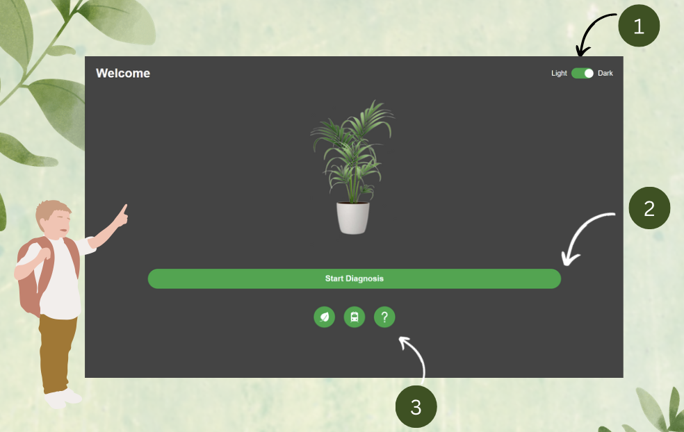
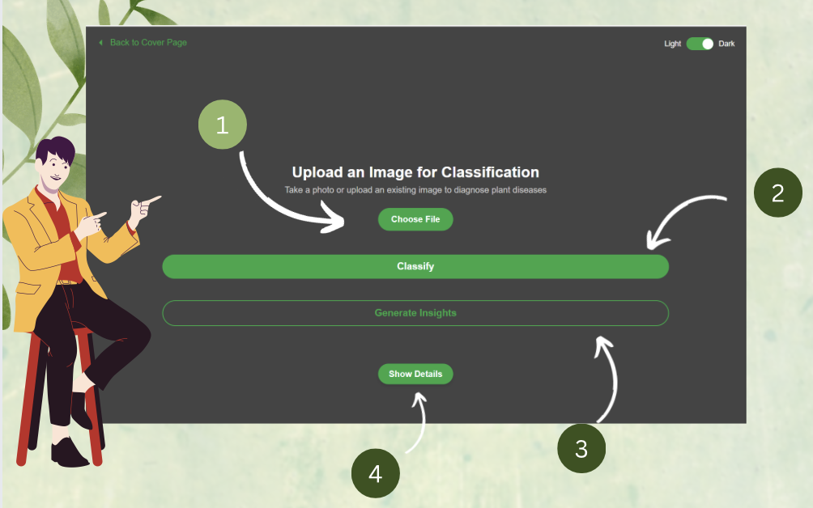

# PlantiDoc-deploy

# 🌱 PlantiDoc - AI-Powered Plant Disease Diagnosis

## 🌟 Introduction
PlantiDoc is a cutting-edge AI-powered web application designed to diagnose plant diseases from images. It leverages SOTA **deep learning models**, specifically **YOLOv11** for object segmentation and **Adaptive Minimal Assemble** for classification, while providing **real-time, accurate plant disease identification and diagnosis** with a local LLM generative AI **Ollama**.

### 🔥 Key Features
- **Smart Plant Disease Detection**: Upload an image or take a photo to get an instant diagnosis.
- **YOLO-based Object Segmentation**: Identifies multiple leaves and detects potential diseases.
- **EfficientNet-architecture Classification**: Classifies up to 39 different classes of 17 plant species. 
- **Ollama Integration**: Generates insights and recommendations based on AI analysis.
- **Flask Backend with REST API**: Efficient backend processing with Flask and Flask-CORS.
- **Seamless Frontend**: User-friendly interface built with HTML, JavaScript, and CSS.

### 🚀 Why Use PlantiDoc?
- **Fast & Accurate**: Leverages state-of-the-art AI models.
- **User-Friendly**: Simple and intuitive UI for farmers, researchers, and hobbyists.
- **Extensible**: Easily scalable with additional models and datasets.
- **Open-Source**: Modify and improve PlantiDoc as per your needs!

---

## 📖 Table of Contents
1. [🔧 Installation Guide](#-installation-guide)
2. [📖 User Manual](#-user-manual)
3. [🔮 Future Developments](#-future-developments)
4. [🛠️ Troubleshooting](#-troubleshooting)
5. [📜 License](#-license)
6. [🤝 Contributing](#-contributing)
7. [📧 Contact](#-contact)

---

## 🔧 Installation Guide
### **1️⃣ Prerequisites**
Ensure you have the following installed:
- **Anaconda** → [Download Anaconda](https://www.anaconda.com/products/distribution)
- **Git** → [Download here](https://git-scm.com/downloads)
- **Ollama App** (for AI-generated insights) → [Install Ollama](https://ollama.com/)

### **2️⃣ Clone the Repository**
Open **Anaconda Prompt (Conda Prompt)** and run:
```bash
git clone https://github.com/myriosMin/PlantiDoc-deploy
cd PlantiDoc-deploy
```

### **3️⃣ Dependencies and Initilization Guide**
Run the following commands in **Anaconda Prompt (Conda Prompt)** with **Python 3.10**:

1. **Create and activate a virtual environment:**
    Skip this if you have done so earlier.
    ```bash
    conda create --name plantidoc-env python=3.10 -y
    conda activate plantidoc-env  
    ```

2. **Install dependencies:**
    ```bash
    pip install -r requirements.txt
    ```

3. **Set up the Ollama model:**
    ```bash
    ollama pull llama3.2
    ollama create plantidoc -f backend/models/Modelfile  # Use 'backend\models\Modelfile' on Windows
    ```

4. **Start the Flask server:**
    ```bash
    cd backend
    python app.py  # Using python to run the app.py
    ```

5. **Open the Frontend:**
   Open the link displayed in your browser [preferably Chrome].

---

## 📚 User Manual
### 🌱 PlantiDoc Homepage


1. Toggle between **dark and light mode**.
2. Click **'Start Diagnosis'** to upload or capture an image.
3. Use the **three round icons** for:
   - Viewing supported plant diseases.
   - Accessing the user manual.
   - Learning more about the project.

### 📸 Upload and Classify Plant Images


1. **Upload an image** or **take a photo** of a plant.
2. Click **'Classify'** to analyze the image.
3. Click **'Generate Insights'** for recommendations.
4. Click **'Show Details'** to expand the full insights.

---

## 🔮 Future Developments
🚀 **Planned Features:**
- Mobile App Version (Android & iOS)
- More Disease Classes
- Real-world Data Collection
- Multilingual Support
- Cloud Deployment

---

## 🛠️ Troubleshooting
### **1️⃣ 'python' or 'pip' Not Recognized**
#### ✅ Solution:
Ensure Python is installed and added to your system PATH.

### **2️⃣ Virtual Environment Not Activating**
#### ✅ Solution:
- **Windows**: Use Command Prompt or PowerShell:
    ```powershell
    Set-ExecutionPolicy Unrestricted -Scope Process
    venv\Scriptsctivate
    ```

### **3️⃣ Generate insights not working**
#### ✅ Solution: Ensure ollana is running. 
- **Windows**: In Command Prompt or PowerShell:
    ```powershell
    ollama run llama3.2
    ```

---

## 💎 Authors & Credits
[Year 2, Computer Vision Project, Diploma in AI & Data Engineering, Nanyang Polytechnic]
- [**Min Phyo Thura**](https://github.com/your-github-handle)  
- [Lim Jin Bin](https://github.com/LimJinBin32)  
- [Alexander Chan](https://github.com/Redbeanchan)  
- [Mohammad Habib](https://github.com/habibmohammad35)

---

## 📜 License
Licensed under the **MIT License with Common Clause**.

## 🤝 Contributing
Contributions are welcome! Open an issue or submit a pull request.

## 📧 Contact
For queries, email **[minmyrios@gmail.com](mailto:minmyrios@gmail.com)** or open a GitHub issue.

---

🚀 **Happy Coding!** 🌱

---

FYI for our teacher: image_preprocessing_augmentation_considerations file is quite big, and both GitHub and BrightSpace has rejected; thus here is the direct link to colab ipynb: https://drive.google.com/file/d/1k2bWSNj7GGjCHzifbsNqYKFkhUVR7y91/view?usp=sharing
